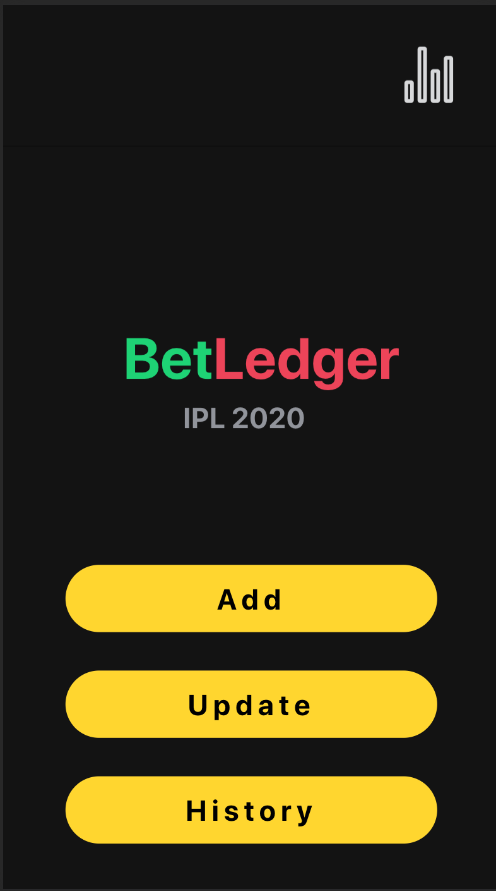

# Bet Ledger

A mobile application to keep track of bets

# Development

Downloand and install NodeJS - https://nodejs.org/en/download/

## npm

It is recommended to install the global Angular and Ionic packages:

`npm install -g @angular/cli`

`npm install -g @ionic/cli`

# Run the project

clone the repository - https://github.com/vishwasanavatti/betLedger.git

go to project folder - `cd betLedger`

`npm install`

`ng serve` - server will start on `localhost:4200`

or

`ionic serve` - server will start on `localhost:8100`
